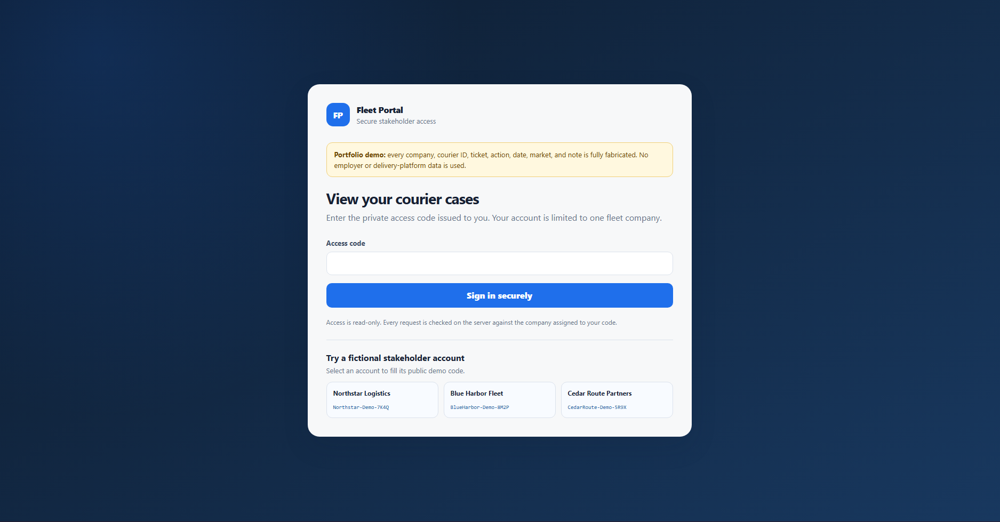
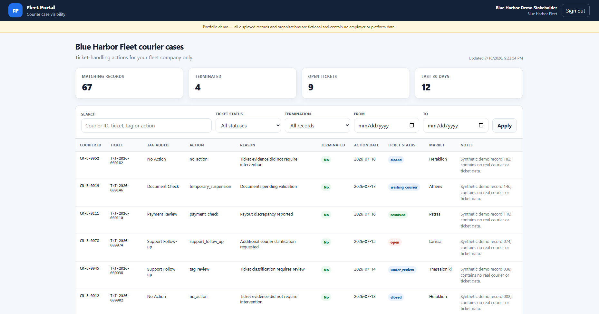
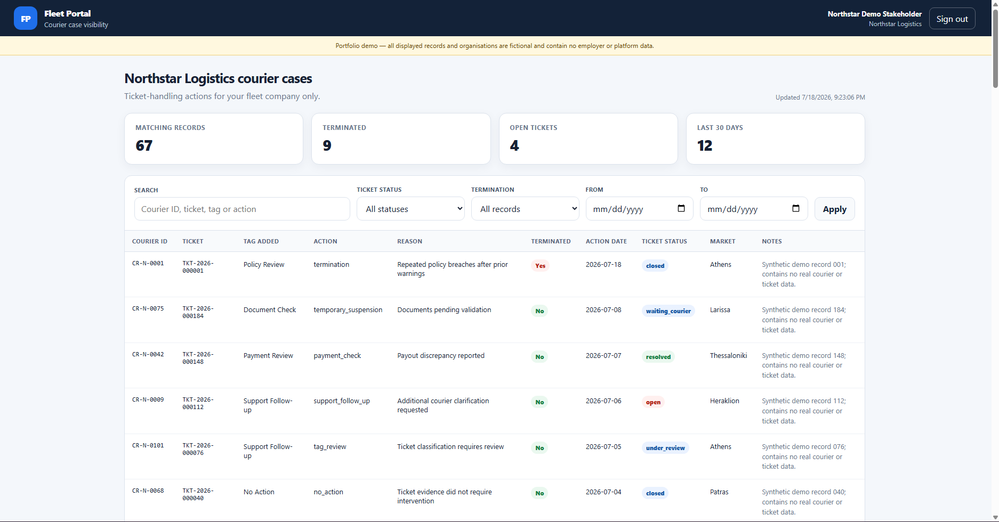

# Fleet Courier Stakeholder Portal

A simple multi-tenant portal where each stakeholder can log in and see only the courier records linked to their own fleet.

> **Data disclaimer:** everything in this repo is fake and was created only for this portfolio project. The company names, courier IDs, tickets, actions, dates, markets and notes are all synthetic. There is no employer data, internal code or confidential information here.

## Try it live

**[Open the live demo](https://script.google.com/macros/s/AKfycbwSK9PBaw3DLnOlor96ypVvqmmHzVU_HGvUqyQGWZerXgIjTzcNsvBUtsu5YAnM0VEsIQ/exec)**

The demo passwords below are public on purpose and only unlock fake data.

| Fictional fleet | Demo password | Records |
|---|---|---:|
| Northstar Logistics | `Northstar-Demo-7K4Q` | 67 |
| Blue Harbor Fleet | `BlueHarbor-Demo-8M2P` | 67 |
| Cedar Route Partners | `CedarRoute-Demo-5R9X` | 66 |

You can also choose a demo account directly from the login page.

## Preview

### Secure stakeholder login



Each stakeholder uses a fleet-specific access code. The account is read-only and linked to one fictional company on the server.

### Fleet-specific dashboard



The dashboard shows company-scoped records, summary metrics and filters for ticket status, termination outcome and date range.

### Tenant separation



Logging in with a different stakeholder account returns a different set of records and summary metrics. The browser never chooses the company; the company is taken from the authenticated server-side session.
## Why I built it

The idea came from a pretty common operations problem: the data already exists, but every stakeholder needs a different part of it.

Without a shared portal, teams often end up creating separate files, sending manual updates and answering the same status questions again and again.

I wanted to build one simple source of truth with one clear rule:

> If you log in as Fleet A, you only see Fleet A's records.

The browser cannot choose another company or request another fleet's data.

## What it does

- Logs stakeholders in with hashed access codes
- Links each session to one fictional fleet
- Filters records on the server, not just in the browser
- Uses random, expiring session tokens
- Includes login rate limiting
- Lets users search and filter by status, date and termination outcome
- Keeps the stakeholder view read-only
- Logs successful logins and record views
- Uses safe text rendering instead of injecting raw HTML

## How the data separation works

```text
demo access code
        |
        v
Apps Script verifies the stored HMAC-SHA-256 hash
        |
        v
the server creates an expiring session token
        |
        v
the session maps to one company_id
        |
        v
CourierActions is filtered by company_id
        |
        v
the user's filters are applied
        |
        v
only that company's rows are returned
```

The browser never sends or selects a `company_id`. That always comes from the authenticated session on the server.

The Google Sheet stays restricted. Users only access the deployed web app. Hidden tabs are there for organisation, not security.

## What this could improve in a real team

A portal like this could help:

- reduce manual stakeholder updates;
- avoid duplicate reporting files;
- give stakeholders a clearer view of case progress;
- cut down on repeated status requests;
- keep different partner organisations properly separated;
- create a better audit trail of who accessed what.

## How I built it

I used Claude and Claude Code agents in Cursor to help me build the project faster.

I came up with the business problem, the user flow, the data structure, the access rules and the testing criteria. I then used AI to help with implementation, debugging, testing and documentation.

The AI helped me move faster, but I still made the decisions, reviewed the code and tested the final workflow myself.

## Synthetic data

Running `setupPortal_` creates 200 fake courier-action records:

- 67 for Northstar Logistics
- 67 for Blue Harbor Fleet
- 66 for Cedar Route Partners
- a mix of tickets, actions, statuses, dates, markets and termination outcomes

The dataset contains no real names, phone numbers, email addresses, home addresses, payment details or personal data.

## Repository structure

| File | What it does |
|---|---|
| `Code.gs` | Authentication, sessions, tenant filtering, setup and audit logging |
| `Index.html` | Login page and stakeholder dashboard |
| `appsscript.json` | Apps Script runtime settings and OAuth scopes |
| `SECURITY_TESTS.md` | Tenant-isolation test cases |
| `.gitignore` | Keeps local Apps Script and environment files out of Git |

## Run your own copy

1. Create a Google Sheet and keep it restricted.
2. Open **Extensions → Apps Script**.
3. Replace the default `Code.gs` with the version in this repo.
4. Add an HTML file called `Index` and paste in `Index.html`.
5. Enable the manifest in Apps Script Project Settings and use `appsscript.json`.
6. Run `setupPortal_` once and approve the required permissions.
7. Reload the Sheet.
8. Deploy the script as a web app running as the owner.
9. Test all three demo accounts before sharing the link.

The setup is idempotent. It creates missing tabs and only adds data to empty ones. If it finds an existing tab with unexpected headers, it stops instead of overwriting anything.

It creates four tabs:

- `CourierActions` — fake ticket and action records
- `CompanyDirectory` — fictional company IDs and names
- `Stakeholders` — fleet mappings and access-code hashes
- `AuditLog` — login and record-view events

## How I would connect it in production

In a real setup, I would not maintain this data manually in a Sheet.

The cleaner approach would be to keep Jira, monday.com or another ticket platform as the source of truth and sync only the fields stakeholders are allowed to see.

```text
Jira / monday.com / ticket platform
                |
                v
API, webhook or scheduled automation
                |
                v
validation, field mapping and deduplication
                |
                v
stakeholder-facing data layer
```

The sync should use stable ticket IDs and upserts, so rerunning it updates existing rows instead of creating duplicates.

This repo does not include a real Jira or monday.com connector. Authentication, mappings, retries, retention and access rules would need to be set up properly for each company.

## Current limitations

- Google Sheets is fine for a lightweight demo, but not for high-volume production use.
- The demo access-code setup is not a replacement for proper enterprise identity management.
- The public portal is read-only.
- A real deployment would need monitoring, credential rotation, access reviews and data-retention rules.
- At larger scale, I would move authentication to a managed identity provider and the data to a proper database or API.
